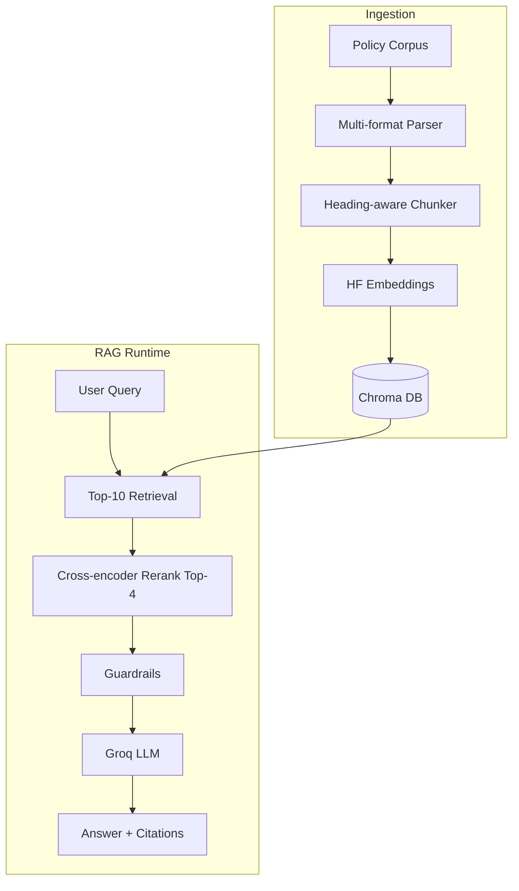

# Design and Evaluation

## Architecture

## Design Decisions

### LLM: Groq (llama-3.3-70b-versatile)

Groq provides fast inference on a free tier, which helps meet latency targets while maintaining strong answer quality. Temperature is set to 0.1 for factual consistency.

### Embeddings: sentence-transformers/all-MiniLM-L6-v2

This model runs locally without API keys, is lightweight enough for Render free tier, and performs well on semantic similarity for short policy passages. Embeddings are L2-normalized for cosine similarity in Chroma.

### Vector Store: Chroma (persistent)

Chroma is simple to deploy locally and on Render without external services. The index is rebuilt during CI/build to ensure reproducibility.

### Chunking: Heading-aware + recursive split

Documents are first split by Markdown/HTML headings to preserve section context. Sections longer than 512 characters are further split with 64-character overlap using RecursiveCharacterTextSplitter. This keeps policy sections intact while avoiding oversized chunks.

### Retrieval: Top-10 → Re-rank to Top-4

Initial vector search retrieves 10 candidates. A cross-encoder (`ms-marco-MiniLM-L-6-v2`) re-ranks them to the top 4 most relevant chunks. This two-stage approach improves precision for citation accuracy.

### Prompt Strategy

The system prompt enforces:
- Answers only from provided context
- Mandatory inline citations `[doc_id: section]`
- Refusal message for out-of-corpus questions
- 300-word maximum

### Guardrails

1. **Out-of-corpus detection:** Refuse if max similarity score < 0.35 or question matches off-topic patterns
2. **Length limit:** Truncate to 300 words
3. **Citation validation:** Ensure cited doc_ids exist in retrieved chunks; append default citation if missing

### Web Framework: Flask

Flask provides clean REST endpoints required by the rubric (`/chat`, `/health`) plus a lightweight Jinja2 UI at `/`.

## Evaluation Methodology

### Dataset

20 gold-standard questions covering PTO, remote work, expenses, security, conduct, benefits, holidays, performance, privacy, onboarding, equipment, and incident reporting. See `evaluation/questions.json`.

### Metrics

| Metric | Method |
|--------|--------|
| Groundedness | LLM-as-judge (Groq) with heuristic verification; uses exact retrieval context from pipeline |
| Citation Accuracy | Cited doc_id matches expected source AND answer contains gold key terms |
| Partial Match | Normalized token overlap between gold answer and generated answer |
| Latency p50/p95 | Wall-clock time for 20 pipeline calls |

### Configuration

- Seed: 42 (deterministic chunking and eval order)
- Retrieval k: 10, rerank k: 4
- 20 evaluation questions

### Results (2026-06-07)

| Metric | Result | Target |
|--------|--------|--------|
| Groundedness | **100.0%** | ≥ 90% |
| Citation Accuracy | **100.0%** | ≥ 85% |
| Partial Match | **99.2%** | ≥ 80% |
| Latency p50 | **580 ms** | < 3,000 ms |
| Latency p95 | **2,815 ms** | < 8,000 ms |
| Latency mean | **1,461 ms** | — |

All 20 evaluation questions passed groundedness, citation accuracy, and partial match checks. See `evaluation/results.json` for per-question details.

## Limitations

- Cross-encoder and embedding models add cold-start latency on first request
- Render free tier sleeps after inactivity (~30s wake time)
- LLM-as-judge groundedness depends on Groq availability
- PDF support included but corpus primarily uses MD/TXT/HTML

## Future Improvements

- Hybrid BM25 + vector retrieval
- Ablation studies on chunk size and k values
- Streaming responses in the UI
- User feedback loop for continuous evaluation
